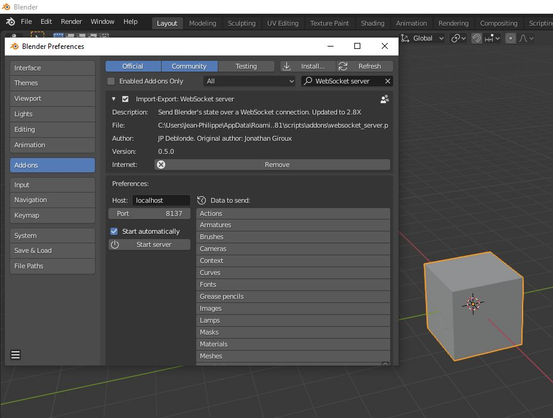

# Updated to 2.8X
The original plugin, made by Jonathan Giroux [WebSocket Server for Blender](https://github.com/KoltesDigital/websocket-server-for-blender) isn't compatible with Blender 2.8X

I updated the code in this version to make it work (tested with Blender 2.81).

# WebSocket server for Blender

This project includes a Blender add-on (server) and a JavaScript library (client).

The server sends its state to the clients, and can receive a few commands to edit Blender remotely.

## Blender

1. Download [WebSocket-for-Python](https://github.com/Lawouach/WebSocket-for-Python/archive/master.zip)
2. Copy the directory `ws4py` into `<Blender root>/2.xx/python/lib`
3. Download `websocket_server.py`
4. in Blender, go to `File` > `User Preferences...` > `Add-ons` > `Install from file...` and select the file
5. Enable the add-on by ticking the corresponding box

Preferences are shown by expanding the add-on box. In particular, you can choose which data to send to the clients, in order to lower communication for unused data.

## JavaScript

Include the library as usual in your HTML.

	

### BlenderWebSocket()

	blender = new BlenderWebSocket();

#### .close()

#### .addListener(event, handler)

Alias: `on`

#### .open([options])

Default options:

* `url`: `ws://localhost:8137`

#### .removeListener(event, handler)

Alias: `off`

#### .setAxes(axes)

Specifies client-side axis permutation.

In Blender, the coordinate system is right-handed and Z is vertical, but you may want another axis depending on your rendering engine. **Only applies on objects' location and scale, not rotation.**

The `axes` parameter is a string (up to 3 characters) containing the mapping for each axis. The first character is the mapping for the resulting X axis, and so on. The character could either be `x`, `y`, `z` (positive) or `X`, `Y`, `Z` (negative).

Example: if you want a right-handed coordinate system and Y as vertical axis, call

	blender.setAxes("xzY")

#### .setContext(context)

#### .setData(data)

#### .setScene(scene, diff)

### Events

## License

Copyright (c) 2015 Bloutiouf aka Jonathan Giroux

[MIT License](http://opensource.org/licenses/MIT)
